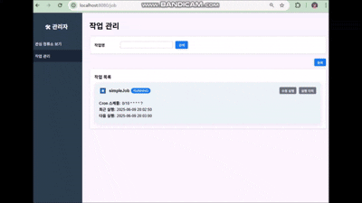
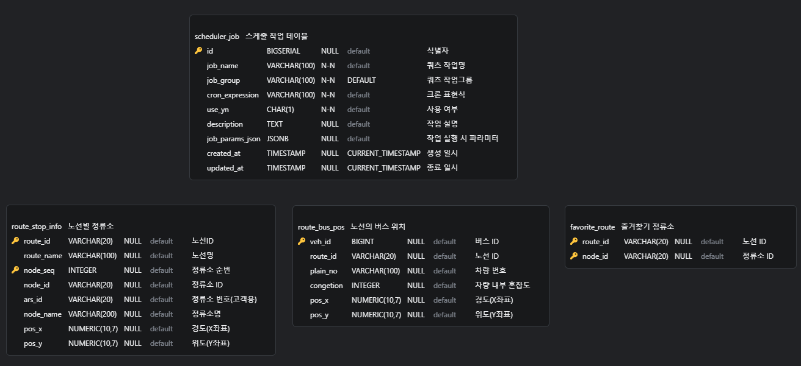

# 프로젝트 구조

이 프로젝트는 Gradle 기반 멀티모듈 구조로 구성되어 있으며, 각 모듈의 역할은 다음과 같다

<pre><code>```
[batch-common]
    └── batch-core와 batch-web에서 공통으로 사용하는 도메인 및 유틸 클래스를 포함한 공통 모듈

[batch-core]
    └── 실제 배치 작업 실행을 담당하는 비즈니스 로직 중심 모듈
    └── Spring Batch와 Quartz를 사용하여 정기적인 Job 실행 처리

[batch-web]
    └── 지도 기반 UI (Geo 관련 기능)
    └── 배치 작업 관리 및 모니터링 기능을 제공하는 웹 기반 실행 모듈
    └── 스케줄 실행 트리거 및 관리 UI 제공
    └── Spring Batch 메타 테이블을 활용한 실행 로그 조회 기능 제공
``` </code></pre>


# 프로젝트 개요

본 프로젝트는 Spring Batch와 Quartz 스케줄러의 실전 적용을 학습하는 데 목적을 두고 있으며,  
카카오 버스앱을 모티브로 하여 버스 위치 정보를 배치 작업으로 수집하고, 지도 기반 UI에서  
시각화하는 기능을 포함한다. 특정 정류장의 버스 도착시간은 실시간 API를 통해 제공되며,  
배치 시스템과는 분리하여 실시간성과 배치 시스템의 경계를 명확히 구분하였다.

### 시연 영상



### 관리자 페이지 기능
* 관심 정류소 보기
	* 지도에 정류장의 위치 정보 표시
	* 관심 정류소의 노선에 속한 모든 버스 위치가 스케줄 간격으로 갱신
      * 스케줄을 아무리 짧게 설정해도 공공 API가 실시간 정보를 주지 않아 10초가 가장 적당하였음 
      * 스케줄을 설정한다는 것은 버스 위치가 언제 변경되는 지 모른다는 것으로 변경될 때만 서버에서 전송하는 SSE 사용
	* 특정 정류소에 버스 도착시간 조회
* 작업 관리
	* 현재 스케줄러에 등록된 Job 리스트 조회
      * 1초 간격으로 Job 정보(실행 상태 등)를 갱신하기 위해 polling 사용
	* 배치 작업 수동실행, 스케줄 재개 및 중단, 스케줄 조정 기능 제공
      * REST API로 스케줄을 동적으로 관리가 가능하다
	* 배치 작업의 실행 이력 조회 모달(페이지네이션)


### 스케줄러
Quartz를 사용한 이유는 다중 배치서버에서 스케줄 Job의 실행 중복이 일어나지 않도록 Quartz(스케줄) 클러스터링이  
필요하다는 가정을 하였다. 또한 관리자 페이지에서 작업을 동적으로 스케줄링하기 위해 사용하였다.

### 배치 작업
* simpleJob : Tasklet Step으로 구현된 테스트용 Job
* routeStopExcelJob : 엑셀 파일을 읽어 노선별 전체 정류소 정보를 DB에 저장
* routeBusPosApiJob : 공공데이터 포털의 버스 위치 API를 호출하여 관심 노선에 속한 버스들의 실시간 위치 정보를 주기적으로 수집하고 저장한다.
* routeStopExcelParallelJob : routeStopExcelJob 배치 작업의 병렬 처리 버전으로 구현한 작업 

### 병렬 처리(성능 개선 작업)
routeStopExcelJob 배치 작업은 내 PC에서 작업 시간이 평균 50 ~ 55초 정도 걸렸다. 47,628건의 정류소 정보가 엑셀에  
존재하였지만 이렇게 오래걸릴 작업은 아니라 생각하여 Writer를 JPA 방식에서 JDBC로 변경하였다.  
병렬 처리 없이 JdbcBatchItemWriter로만 변경해도 50 ~ 55초 걸리던 작업이 6 ~ 8초 정도로 8배 정도 성능이 개선되었다.  
또한 JdbcBatchItemWriter는 Thread-Safe 하다는 것을 공식 gibhub 코드의 javadoc으로 확인하였다.  
그러나 엑셀파일을 읽을 때 사용했던 PoiItemReader는 Thread-Safe하지 못함을 확인해서 별도 구현이 필요했다.  
PoiItemReader를 Thread-Safe 하게 변경하는 방법(동기화 처리)보다 Partitioning 방식으로 구현하여 엑셀 파일을 N개의  
조각으로 나누고 동시에 읽는 방식이 성능 개선이 극대화 될 것이라 판단하고 Partitioning 방식으로 구현하였다.
최종적으로 병렬 처리를 구현하고 chunk 사이즈를 조정하여 5초 이내로 작업을 처리할 수 있었다.
나중에 깨달은 사실이지만 엑셀 파일로 처리하기보다는 csv 파일로 변환하여 처리하면 극적인 성능 개선을 이룰 수 있을 것이다.


# 개발 환경

### batch-core 기술
* Spring Boot 3.4.5 (JDK 17)
* spring-boot-starter-quartz 3.4.5 : 스케줄러(org.quartz-scheduler:quartz:2.3.2)
* spring-boot-starter-batch 5.2.2
* JPA
* postgresql


### batch-web 기술
* Spring Boot 3.4.5 (JDK 17)
* thymeleaf
* JPA
* postgresql
* Kakao Map API


# ERD

작업 위치 : batch-core 프로젝트의 /resources/sql  
erd.vuerd.json : ERD 파일(ERD 툴 : vscode의 확장인 ERD Editor)  
schema.sql : 테이블 생성 DDL 파일  


# 외부 API

공공데이터포털 API에 활용신청하고 승인이 되었어도 인증키가 해당 기관에 동기화되어 유효할 때까지 상당히 오래걸렸다. (일주일 정도 걸린 듯 하다)

### 공공데이터포털 API
* 노선ID와 구간정보로 차량들의 위치정보를 조회
	* 문서 링크 : https://www.data.go.kr/data/15000332/openapi.do
	* 서비스 URL : http://ws.bus.go.kr/api/rest/buspos/getBusPosByRouteSt
* 특정 정류소에 대한 버스 도착예정 정보 제공
	* 문서 링크 : https://www.data.go.kr/data/15000314/openapi.do
	* 서비스 URL : http://ws.bus.go.kr/api/rest/arrive/getArrInfoByRouteAll
* 노선에 대한 정보 제공
	* 문서 링크 : https://www.data.go.kr/data/15000193/openapi.do
	* 서비스 URL : http://ws.bus.go.kr/api/rest/busRouteInfo/getStaionByRoute

### 서울 열린데이터광장
* 서울시 버스 노선 정보 조회
	* 문서 링크 : https://data.seoul.go.kr/dataList/OA-1095/F/1/datasetView.do
	* xlsx 파일 제공
* 서울시 버스정류소 위치정보(사용안함)
	* 문서 링크 : https://data.seoul.go.kr/dataList/OA-15067/S/1/datasetView.do
	* xlsx 파일 제공

### 카카오 맵 API
* 문서 링크 : https://apis.map.kakao.com/web/documentation/